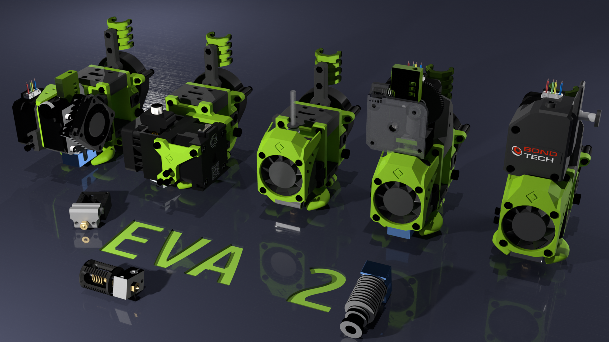

# EVA 2 / Spec

As an attempt to make it easier to contribute to EVA I made a drawing showing all of the important dimensions of EVA. Please see bellow to find what it means for a carriage to be "EVA compatible".

!!! question "Not what you are looking for?"

    EVA is split into multiple repositories to make it more managable - think about it like remixes on Thingiverse.

    You can find everything that's related to EVA here: [:octicons-mark-github-16: EVA-3D](https://github.com/EVA-3D)

## Versions

### 2.x.x

[:octicons-file-symlink-file-24: spec-2.1.0.pdf](assets/spec-2.1.0.pdf)

The most important is the hole spacing for the 4 main screws holding the front part, through the top and bottom to the back. That spacing changed in 2.0.0.
Another thing the the fan outlet.
Then the three holes on the top of the back part describing the accessory standard (toolboard, cable holders, etc).
Of the front part there is a cut out for the new top parts.

The width is not very important but remember that it steals X space, the height should not be exceeded (unless there is a good reason for it).

[:octicons-package-24: Onshape](https://cad.onshape.com/documents/b24cb1c807e8db4cb3906340/v/5ffa689858ef6845035b077c/e/52bcef158f0c052b792a3519)

### 1.x.x

Previous EVA was a loosely defined spec but is not cosiderred obsolete. You can find the previous EVA here: https://github.com/pkucmus/EVA

